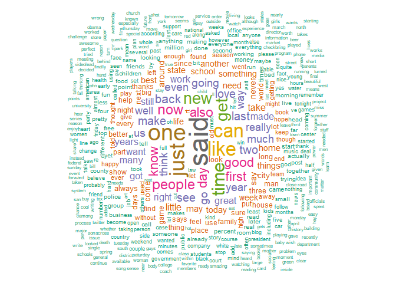
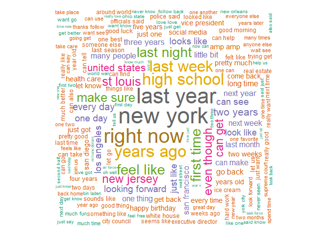

## Synopsis

The goal is to build a next word prediction NLP model using 3 datasets provided by Swiftkey. One from twitter, one from news and one from blogs. Then make a easy to use shiny app with the model.

## Packages

Load the R packages needed further. It's also good to set system locale to avoid problems related with system differences between regions.


```r
library(data.table, quietly = T, warn.conflicts = F)
library(dplyr, quietly = T, warn.conflicts = F)
library(plotly, quietly = T, warn.conflicts = F)
library(ggplot2, quietly = T, warn.conflicts = F)
library(ggpubr, quietly = T, warn.conflicts = F)
library(quanteda, quietly = T, warn.conflicts = F)
```

```
## Package version: 2.1.2
```

```
## Parallel computing: 2 of 4 threads used.
```

```
## See https://quanteda.io for tutorials and examples.
```

```r
library(tm, quietly = T, warn.conflicts = F)
```

```
## 
## Attaching package: 'NLP'
```

```
## The following objects are masked from 'package:quanteda':
## 
##     meta, meta<-
```

```
## The following object is masked from 'package:ggplot2':
## 
##     annotate
```

```r
Sys.setlocale('LC_ALL','English')  
```

```
## [1] "LC_COLLATE=English_United States.1252;LC_CTYPE=English_United States.1252;LC_MONETARY=English_United States.1252;LC_NUMERIC=C;LC_TIME=English_United States.1252"
```

## Getting data

Start by creating a directory to store data and download it from the web. While doing it, create a text file which states the time/timezone of download for reference purposes.  


```r
datadir <- './data'
datazipurl <- 'https://d396qusza40orc.cloudfront.net/dsscapstone/dataset/Coursera-SwiftKey.zip'

datazippath <- paste0(datadir,'/dataset.zip')
datafinaldir <- paste0(datadir,'/final/en_US')

if(!dir.exists(datadir)){
        dir.create(datadir)
}

if(!dir.exists(datafinaldir)){
        if(!file.exists(datazippath)){
                download.file(url = datazipurl,destfile = datazippath,method = 'curl')
        
        time <- as.character(Sys.time())
        timezone <- Sys.timezone()
        
        downloadinfo <- data.frame(list(time = time, 
                             format = "%Y-%m-%d %H:%M:%S",
                             timezone = timezone))
        write.table(x = downloadinfo,
                    file = paste0(datadir,'/downloadinfo.txt'),
                    row.names = F)
        }
        
        unzip(datazippath,exdir = datadir)
}

sourcepaths <- paste0(datafinaldir,'/',dir(paste0(datafinaldir))) 
```

Load data into R. 

We have texts that come from 3 different type of source: blogs, news and twitter. So we load each into a different dataframe to take a look at each separately.


```r
if(!file.exists(paste0(datadir,'/sample.txt'))){
        textsnews <- fread(text=sourcepaths[2],
                           header = F,
                           sep = '',
                           sep2='',
                           data.table = T,
                           quote='')
                
        textsnews <- rbind(textsnews,fread(text=sourcepaths[2],
                           header = F,
                           sep = '',
                           sep2='',
                           data.table = T,
                           quote='',
                           skip = 987097))
                
        textstwitter <- fread(text=sourcepaths[3],
                           header = F,
                           sep = '',
                           sep2='',
                           data.table = T,
                           quote='')
                
        textsblogs<-fread(text=sourcepaths[1],
                           header = F,
                           sep = '',
                           sep2='',
                           data.table = T,
                           quote=' ')
                
        textsblogs <- rbind(textsblogs,
                            fread(text=sourcepaths[1],
                                   header = F,
                                   sep = '',
                                   sep2='',
                                   data.table = T,
                                   quote=' ',
                                   skip = 615492))
                
        textsblogs <- rbind(textsblogs,
                            fread(text=sourcepaths[1],
                                   header = F,
                                   sep = '',
                                   sep2='',
                                   data.table = T,
                                   quote=' ',
                                   skip = 741885))
        }
```

## Brief Exploratory Data Analysis

We have loaded 2360148 tweets, 899286 blog texts and 1010241 news texts.

Let's take a good look at text lengths from each source.


```r
news <- textsnews %>% 
        mutate(compri = nchar(V1,type='char')) %>% 
        arrange(desc(compri))
blogs <- textsblogs %>% 
        mutate(compri = nchar(V1,type='char')) %>% 
        arrange(desc(compri))
twitter <- textstwitter %>%
        mutate(compri = nchar(V1,type='char')) %>% 
        arrange(desc(compri))
```


```r
g1<- ggplot(twitter, aes(x = compri)) 
g1 <- g1 + geom_histogram(binwidth = 10) + theme_bw() 
g1 <- g1 + labs(title ='Twitter', x = 'Length')
```


```r
g2 <- ggplot(blogs, aes(x = compri)) 
g2 <- g2 + geom_histogram(binwidth = 100) + theme_bw()
g2 <- g2 + labs(title ='Blogs', x = 'Length')
```


```r
g3 <- ggplot(news, aes(x = compri)) 
g3 <- g3 + geom_histogram(binwidth = 100) + theme_bw()
g3 <- g3 + labs(title ='News', x = 'Length')
```


```r
ggarrange(g1,g2,g3,ncol=3)
```

<!-- -->

We can see there is some potential outliers in blogs and news. We take care of it here.


```r
blogs <- blogs %>% filter(compri < 2500)
news <- news %>% filter(compri < 1500)
```


```r
g1<- ggplot(twitter, aes(x = compri)) 
g1 <- g1 + geom_histogram(binwidth = 10) + theme_bw() 
g1 <- g1 + labs(title ='Twitter', x = 'Length')
```


```r
g2 <- ggplot(blogs, aes(x = compri)) 
g2 <- g2 + geom_histogram(binwidth = 100) + theme_bw()
g2 <- g2 + labs(title ='Blogs', x = 'Length')
```


```r
g3 <- ggplot(news, aes(x = compri)) 
g3 <- g3 + geom_histogram(binwidth = 100) + theme_bw()
g3 <- g3 + labs(title ='News', x = 'Length')
```


```r
ggarrange(g1,g2,g3,ncol=3)
```

<!-- -->


We have blogs with highest lengths, followed by news then twitter. Nothing out of the expected given the way each one is used.

Now, a look at love/hate presence ratio in tweets. 


```r
lhratio <- twitter %>% 
        transmute(love = grepl('love',V1), hate = grepl('hate',V1)) %>%
        summarise(ratio = sum(love)/sum(hate))
lhratio
```

```
##      ratio
## 1 4.108592
```

We have 4 times more tweets with the word love present than with hate.

Now let's take a look at some tweets, starting with the ones with "biostats" present.


```r
sometweet <- twitter %>% summarise(tweets = grep('biostats',V1,value = T))
sometweet
```

```
##                                                                        tweets
## 1 i know how you feel.. i have biostats on tuesday and i have yet to study =/
```

Well, you gotta study. We can see there is the presence of emoticons, at least in one tweet. 

Now the ones that match the sentence "A computer once beat me at chess, but it was no match for me at kickboxing".


```r
someothertweets <- twitter %>% summarise(tweets = grep("A computer once beat me at chess, but it was no match for me at kickboxing",V1,value = T))
someothertweets
```

```
##                                                                       tweets
## 1 A computer once beat me at chess, but it was no match for me at kickboxing
## 2 A computer once beat me at chess, but it was no match for me at kickboxing
## 3 A computer once beat me at chess, but it was no match for me at kickboxing
```

We can see here there is some repeated tweets, which is a very common thing to happen at Twitter. We better take care of it right away.


```r
nbefore<- lengths(twitter)
```


```r
twitter <- twitter %>% unique
nafter<-lengths(twitter)
```

We have eliminated 54225 repeated tweets from dataset. The same thing doesn't happen with the other two sources, so let them be.

Now we can take randomly, and without replacement, representative equal size samples from each source to form the dataset to be used further. Since we have a lot of data, and there is some lack of computation resources, it's ok to use smaller samples to get a grasp of what the population would be like.


```r
if(!file.exists(paste0(datadir,'/sample.txt'))){
        texts <- slice_sample(twitter, n = 3e4, replace=F)
        texts <- rbind(texts,slice_sample(blogs, n = 3e4, replace=F))
        texts <- rbind(texts,slice_sample(news, n = 3e4, replace=F))
        write.table(texts,file = paste0(datadir,'/sample.txt'))
}else{
        texts <- fread(text=paste0(datadir,'/sample.txt'),
                                   header = F,
                                   sep = '',
                                   sep2='',
                                   data.table = T,
                                   quote=' ',
                                   skip = 741885)
}
```

### Creating corpus

We build a corpus using the Quanteda package.


```r
modelcorpus <- corpus(texts$V1)
```

Let's take a look at the sentence distribution from the corpus.


```r
g <- ggplot(data = summary(modelcorpus), aes(x = Sentences))
g<- g + theme_bw() + geom_histogram(binwidth = 1)
g
```

<!-- -->

Mainly one sentence texts, followed by 2 and 3.

### Document-Feature Matrix

First we need to make word tokens, removing stop words, punctuation, numbers, symbols, separators. This way we can do a better data analysis. Then we make the dfm.


```r
modeldfm <- tokens(modelcorpus,
                     remove_punct = TRUE,
                     remove_symbols = T,
                     remove_separators = T,
                     remove_numbers=T) %>%
        tokens_select(stopwords('english'), 
                      selection = 'remove',
                      min_nchar = 2) %>% dfm()
```

What is the top 20 features of the corpus?


```r
topfeatures(modeldfm,10)
```

```
## said will  one just like  can time  get  new  now 
## 8716 8198 7678 6812 6233 6078 5479 5172 4662 4087
```

A better way to see this is a word cloud.


```r
textplot_wordcloud(modeldfm, min_count = 6, random_order = FALSE,
                   rotation = .25, 
                   color = RColorBrewer::brewer.pal(8,"Dark2"))
```

<!-- -->

#### 2-grams

Now we do the same as before but with 2-grams tokens.


```r
modeldfm2 <- tokens(modelcorpus,
                     remove_punct = TRUE,
                     remove_symbols = T,
                     remove_separators = T,
                     remove_numbers=T) %>%
        tokens_select(stopwords('english'), 
                      selection = 'remove',
                      min_nchar = 2) %>%
        tokens_ngrams( n = 2 ) %>% dfm()
```

The top 20 and the word cloud.


```r
topfeatures(modeldfm2,10)
```

```
##   last_year    new_york   right_now       iâ_ve high_school     youâ_re 
##         536         513         501         459         388         340 
##   last_week   years_ago  first_time    st_louis 
##         335         332         325         300
```

```r
textplot_wordcloud(modeldfm2, min_count = 6, random_order = FALSE,
                   rotation = .25, 
                   color = RColorBrewer::brewer.pal(8,"Dark2"))
```

<!-- -->

#### 3-grams

Once again, we do the same as before but with 3-grams tokens.


```r
modeldfm3 <- tokens(modelcorpus,
                     remove_punct = TRUE,
                     remove_symbols = T,
                     remove_separators = T,
                     remove_numbers=T) %>%
        tokens_select(stopwords('english'), 
                      selection = 'remove',
                      min_nchar = 2) %>%
        tokens_ngrams( n = 3 ) %>% dfm()
```

The top 20 and the word cloud.


```r
topfeatures(modeldfm3,10)
```

```
##          new_york_city            amp_amp_amp            let_us_know 
##                     81                     74                     51 
##           world_war_ii          two_years_ago        st_louis_county 
##                     37                     35                     35 
##         new_york_times     gov_chris_christie president_barack_obama 
##                     33                     33                     30 
##          cinco_de_mayo 
##                     29
```

```r
textplot_wordcloud(modeldfm3, min_count = 6, random_order = FALSE,
                   rotation = .25, 
                   color = RColorBrewer::brewer.pal(8,"Dark2"))
```

<!-- -->


