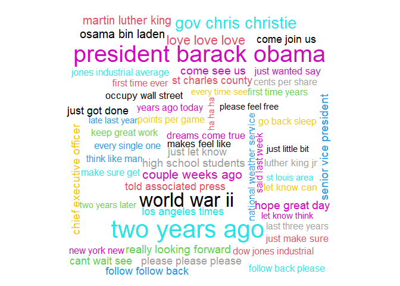

## Synopsis

The project was to build a next word suggestion (or prediction) app. This was done with a NLP model using 3 datasets provided by Swiftkey. One from twitter, one from news and one from blogs. The dataset provided the means on which the model would be trained. 

The resulted app was made available to use at [this webpage](https://wildson-b-b-lima.shinyapps.io/nextword/?_ga=2.227190941.1485234620.1604767179-10188108.1604271857).

## Packages

Load the R packages needed further. It's also good to set system locale to avoid problems related with system differences between regions.


```r
library(data.table, quietly = T, warn.conflicts = F)
library(dplyr, quietly = T, warn.conflicts = F)
library(ggplot2, quietly = T, warn.conflicts = F)
library(ggpubr, quietly = T, warn.conflicts = F)
library(quanteda, quietly = T, warn.conflicts = F)
```

```
## Package version: 2.1.2
```

```
## Parallel computing: 2 of 4 threads used.
```

```
## See https://quanteda.io for tutorials and examples.
```

```r
library(wordcloud, quietly = T, warn.conflicts = F)

Sys.setlocale('LC_ALL','English')  
```

```
## [1] "LC_COLLATE=English_United States.1252;LC_CTYPE=English_United States.1252;LC_MONETARY=English_United States.1252;LC_NUMERIC=C;LC_TIME=English_United States.1252"
```

## Getting data

Start by creating a directory to store data and download it from the web. While doing it, create a text file which states the time/timezone of download for reference purposes.  


```r
datadir <- './data'
datazipurl <- 'https://d396qusza40orc.cloudfront.net/dsscapstone/dataset/Coursera-SwiftKey.zip'

datazippath <- paste0(datadir,'/dataset.zip')
datafinaldir <- paste0(datadir,'/final/en_US')
profpath <- paste0(datadir,'/profwords.txt')
```


```r
if(!dir.exists(datadir)){
        dir.create(datadir)
}

if(!file.exists(profpath)){
        profurl <- "https://raw.githubusercontent.com/LDNOOBW/List-of-Dirty-Naughty-Obscene-and-Otherwise-Bad-Words/master/en"
        download.file(profurl, destfile=profpath, mode="wb")
}

if(!dir.exists(datafinaldir)){
        if(!file.exists(datazippath)){
                download.file(url = datazipurl,destfile = datazippath,method = 'curl')
                
                time <- as.character(Sys.time())
                timezone <- Sys.timezone()
                
                downloadinfo <- data.frame(list(time = time, 
                                                format = "%Y-%m-%d %H:%M:%S",
                                                timezone = timezone))
                write.table(x = downloadinfo,
                            file = paste0(datadir,'/downloadinfo.txt'),
                            row.names = F)
        }
        
        unzip(datazippath,exdir = datadir)
}

sourcepaths <- paste0(datafinaldir,'/',dir(paste0(datafinaldir))) 
```

Load data into R. 

We have texts that come from 3 different type of source: blogs, news and twitter. So we load each into a different data table to take a look at each separately.


```r
profwords <- fread(text=profpath,
                   header = F,
                   sep = '',
                   sep2='',
                   data.table = T,
                   quote='',stringsAsFactors = F)

textsnews <- fread(text=sourcepaths[2],
                   header = F,
                   sep = '',
                   sep2='',
                   data.table = T,
                   quote='',stringsAsFactors = F)

textsnews <- rbind(textsnews,fread(text=sourcepaths[2],
                                   header = F,
                                   sep = '',
                                   sep2='',
                                   data.table = T,
                                   quote='',
                                   skip = 987097,stringsAsFactors = F))

textstwitter <- fread(text=sourcepaths[3],
                      header = F,
                      sep = '',
                      sep2='',
                      data.table = T,
                      quote='',stringsAsFactors = F)

textsblogs<-fread(text=sourcepaths[1],
                  header = F,
                  sep = '',
                  sep2='',
                  data.table = T,
                  quote=' ',stringsAsFactors = F)

textsblogs <- rbind(textsblogs,
                    fread(text=sourcepaths[1],
                          header = F,
                          sep = '',
                          sep2='',
                          data.table = T,
                          quote=' ',
                          skip = 615492,stringsAsFactors = F))

textsblogs <- rbind(textsblogs,
                    fread(text=sourcepaths[1],
                          header = F,
                          sep = '',
                          sep2='',
                          data.table = T,
                          quote=' ',
                          skip = 741885,stringsAsFactors = F))
```

## Brief Exploratory Data Analysis

We have loaded 2360148 tweets, 899286 blog texts and 1010241 news texts.

Let's take a good look at text lengths from each source.


```r
news <- textsnews %>% 
        mutate(compri = nchar(V1,type='char')) %>% 
        arrange(desc(compri))
blogs <- textsblogs %>% 
        mutate(compri = nchar(V1,type='char')) %>% 
        arrange(desc(compri))
twitter <- textstwitter %>%
        mutate(compri = nchar(V1,type='char')) %>% 
        arrange(desc(compri))
```


```r
makeplot <- function(title,data){
        g1<- ggplot(mapping=aes(x = data)) 
        g1 <- g1 + geom_histogram(binwidth = 10) + theme_bw() 
        g1 <- g1 + labs(title = title, x = 'Length')
        return(g1)
}
```


```r
g1 <-makeplot('Twitter', twitter$compri)
g2 <-makeplot('Blogs', blogs$compri)
g3 <-makeplot('News', news$compri)
```


```r
ggarrange(g1,g2,g3,ncol=3)
```

<!-- -->

We can see there is some potential outliers in blogs and news. We take care of it right away.


```r
blogs <- blogs %>% filter(compri < 2500)
news <- news %>% filter(compri < 1500)
```


```r
g1 <-makeplot('Twitter', twitter$compri)
g2 <-makeplot('Blogs', blogs$compri)
g3 <-makeplot('News', news$compri)
```


```r
ggarrange(g1,g2,g3,ncol=3)
```

<!-- -->

We have blogs with highest lengths, followed by news then twitter. Nothing out of the expected given the way each one is used.

Now, a look at love/hate presence ratio in tweets. 


```r
lhratio <- twitter %>% 
        transmute(love = grepl('love',V1), hate = grepl('hate',V1)) %>%
        summarise(ratio = sum(love)/sum(hate))
lhratio
```

```
##      ratio
## 1 4.108592
```

We have 4 times more tweets with the word love present than with hate.

Now let's take a look at some tweets, starting with the ones with "biostats" present.


```r
sometweet <- twitter %>% summarise(tweets = grep('biostats',V1,value = T))
sometweet
```

```
##                                                                        tweets
## 1 i know how you feel.. i have biostats on tuesday and i have yet to study =/
```

Well, you gotta study. We can see there is the presence of emoticons, at least in one tweet. It will be taken care later.

Now the ones that match the sentence "A computer once beat me at chess, but it was no match for me at kickboxing".


```r
someothertweets <- twitter %>% summarise(tweets = grep("A computer once beat me at chess, but it was no match for me at kickboxing",V1,value = T))
someothertweets
```

```
##                                                                       tweets
## 1 A computer once beat me at chess, but it was no match for me at kickboxing
## 2 A computer once beat me at chess, but it was no match for me at kickboxing
## 3 A computer once beat me at chess, but it was no match for me at kickboxing
```

We can see here there is some repeated tweets, which is a very common thing to happen at Twitter. We better take care of it right away.


```r
nbefore<- lengths(twitter)
twitter <- twitter %>% unique
nafter<-lengths(twitter)
```

We have eliminated 54225 repeated tweets from dataset. The same thing doesn't happen with the other two sources, so let them be.

Now we can take randomly, and without replacement, representative equal prop samples from each source to form the dataset to be used further. Since we have a lot of data, and there is some lack of computation resources, it's ok to use smaller samples to just get a grasp of what the population would be like.


```r
if(!file.exists(paste0(datadir,'/sample.txt'))){
        texts <- slice_sample(twitter, prop = .2, replace=F)
        texts <- rbind(texts,slice_sample(blogs, prop = .2, replace=F))
        texts <- rbind(texts,slice_sample(news, prop = .2, replace=F))
        write.table(texts$V1,file = paste0(datadir,'/sample.txt'),row.names = F,col.names = F)
}else{
        texts <- fread(text=paste0(datadir,'/sample.txt'),
                       header = F,
                       sep = '',
                       data.table = T,stringsAsFactors = F)
}
```


### Creating corpus

We need to build a corpus with the sample of texts using the Quanteda package to used further.


```r
modelcorpus <- corpus(texts$V1)
```

### Document-Feature Matrix

First we need to make word tokens, removing stop words, punctuation, numbers, symbols, separators, profane words. This way we can do a better data analysis of the text features. Then we make the dfm from which we take the n-gram frequencies.


```r
tokenizer <- function(corpus){
    words <- tokens(corpus,
                    remove_punct = TRUE,
                    remove_symbols = T,
                    remove_separators = T,
                    remove_numbers=T,
                    what = 'word') %>%
        tokens_remove(stopwords('english')) %>%
        tokens_remove(pattern = '[^A-Za-z]|^[a-zA-Z]$',valuetype = 'regex') %>%
        tokens_remove(profwords$V1)
    return(words)
}
```


```r
modeltokens <- tokenizer(modelcorpus)
```


```r
makengramfreq <- function(n=1){
    
    model <- modeltokens %>% 
        tokens_ngrams( n = n , concatenator = ' ') %>% 
        dfm() %>% docfreq() %>%
        data.table(ngram = names(.), frequency = .) %>%
        arrange(desc(frequency)) %>% filter(frequency>1)
    
    return(model)
}
```


```r
model1 <-  makengramfreq(1)
model2 <-  makengramfreq(2)
model3 <-  makengramfreq(3)
```


#### 1-gram

What is the top 10 feature frequency of the corpus?


```r
head(model1,10)
```

```
##     ngram frequency
##  1:  just     56040
##  2:  said     55148
##  3:   one     50518
##  4:  like     48601
##  5:   can     43281
##  6:   get     41619
##  7:  time     38537
##  8:   new     34538
##  9:   now     33835
## 10:  good     32526
```

A better way to see this distribution is a word cloud.


```r
top <- model1 %>% head(100) 
wordcloud(words = top$ngram,freq = top$frequency,ordered.colors = T,colors =1:100)
```

<!-- -->

#### 2-grams

what is the top 10 feature frequency of the corpus?


```r
head(model2,10)
```

```
##               ngram frequency
##  1:       right now      5000
##  2:       last year      3667
##  3:        new york      3582
##  4:      last night      3092
##  5:     high school      2612
##  6:       years ago      2597
##  7:       last week      2520
##  8:       feel like      2484
##  9:      first time      2362
## 10: looking forward      2248
```


```r
top <- model2 %>% head(100) 
wordcloud(words = top$ngram,freq = top$frequency,ordered.colors = T,colors =1:100)
```

<!-- -->

#### 3-grams

What is the top 10 feature frequency of the corpus?


```r
head(model3,10)
```

```
##                      ngram frequency
##  1:            let us know       505
##  2:          new york city       478
##  3:         happy new year       344
##  4:      happy mothers day       328
##  5:          two years ago       308
##  6: president barack obama       284
##  7:         new york times       272
##  8:          cinco de mayo       252
##  9:           world war ii       223
## 10:        st louis county       217
```


```r
top <- model3 %>% head(100) 
wordcloud(words = top$ngram,freq = top$frequency,ordered.colors = T,colors =1:100)
```

<!-- -->

## Prediction  Model

We use a [Katz' back-off](https://en.wikipedia.org/wiki/Katz%27s_back-off_model) model, a generative n-gram language model, to predict next words in a sentence. It estimates the conditional probability of a word given its n-gram history.

To do this, we need each n-gram we just build.


```r
model <- rbind(model1,model2)
rm(model2)
model <- rbind(model,model3)
rm(model3)
```

We make a function to take input text, calculate the back-off conditional probability with the n-grams we have then output top probability n-gram. The count discount due to unseen n-grams was chosen to be a random number between 0 and 0.5.


```r
nextword <- function(input = ' New york new york nek york! !'){
    words <-  tokenizer(char_tolower(input))
    
    
    for(i in 2:1){
        put <- words[[1]] %>% 
            tail(i) %>% 
            paste(., collapse = ' ')
        
        nminus1gram <- model %>%
            filter(ngram == put)
        
        if(length(nminus1gram$frequency)==0){
            next
        }
        
        output <- model %>%
            filter(grepl(pattern = paste0('^',put,'\\s.*'),x = ngram)) %>%
            arrange(desc(frequency)) %>% rowwise() %>%
            mutate(prob = (frequency-runif(1,max = .5))/nminus1gram$frequency) %>%
            head(1)
        
        
        if(lengths(output[,1])!=0){
            return(tail(strsplit(output$ngram,' ')[[1]],1))
            
        }
        
    }
    
    output <- model1 %>%
        arrange(desc(frequency)) %>% 
        mutate(prob = frequency/sum(frequency)) %>%
        head(1)
    
    stopCluster(cluster)
    registerDoSEQ()
    return(tail(strsplit(output$ngram,' ')[[1]],1))
}
```

Some more examples follows:


```r
nextword("The guy in front of me just bought a pound of bacon, a bouquet, and a case of")
```

```
## [1] "wondering"
```


```r
nextword("You're the reason why I smile everyday. Can you follow me please? It would mean the")
```

```
## [1] "world"
```


```r
nextword("Hey sunshine, can you follow me and make me the")
```

```
## [1] "happy"
```


```r
nextword("Very early observations on the Bills game: Offense still struggling but the")
```

```
## [1] "get"
```


```r
nextword("Go on a romantic date at the")
```

```
## [1] "night"
```


```r
nextword("Well I'm pretty sure my granny has some old bagpipes in her garage I'll dust them off and be on my")
```

```
## [1] "storms"
```


```r
nextword("Ohhhhh #PointBreak is on tomorrow. Love that film and haven't seen it in quite some")
```

```
## [1] "time"
```


```r
nextword("After the ice bucket challenge Louis will push his long wet hair out of his eyes with his little")
```

```
## [1] "bit"
```


```r
nextword("Be grateful for the good times and keep the faith during the")
```

```
## [1] "good"
```


```r
nextword("If this isn't the cutest thing you've ever seen, then you must be")
```

```
## [1] "say"
```

It can be seen results doesn't always make sense, but that is because the model doesn't take into account long sentence context, just the last words.


